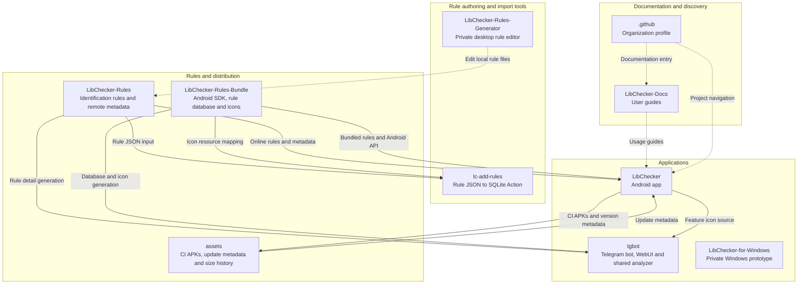

  

<h3 align="center">Discover what is inside your apps.</h3>

  Android app inspection, community-maintained library rules, and APK analysis on the web.
   
  查看应用使用的库，比较更新前后的差异。

  <a href="https://github.com/LibChecker/LibChecker/releases">Download</a> ·
  <a href="https://lc.absinthe.life/">WebUI</a> ·
  <a href="https://github.com/LibChecker/LibChecker-Docs">Documentation</a> ·
  <a href="https://github.com/LibChecker/LibChecker-Rules/issues/new/choose">Contribute rules</a> ·
  <a href="https://t.me/libcheckerr">Community</a>

## One ecosystem, several ways to explore

**LibChecker for Android** inspects installed apps and package files, identifies libraries and SDKs, and compares app snapshots. **WebUI and the Telegram bot** bring package analysis to the browser and chat. They share the community's library identification data through **LibChecker-Rules** and **LibChecker-Rules-Bundle**.

## How the repositories fit together

Solid arrows show data, build inputs, or published artifacts moving to a consumer. Dashed arrows show editing or documentation relationships. The diagram includes private tools; their links require repository access.

- **Rules have two delivery paths.** The Android app uses the bundled SDK and also reads online rule data. The bot/WebUI build generates local JavaScript data from the bundle's database and icons, enriched with metadata from the rules repository. App information exported from Android can also be opened in WebUI.
- **Import tooling is separate from publication.** `lc-add-rules` can insert rule JSON into a supplied SQLite database using the bundle's icon mapping. Its presence does not imply an active automatic Rules → Bundle release pipeline.
- **Windows is a prototype.** It is shown for completeness; no shared-rule integration is represented for it.

## Repository guide

| Repository | Responsibility | Access |
| --- | --- | --- |
| [LibChecker](https://github.com/LibChecker/LibChecker) | Android application: package inspection, library identification, statistics and snapshot comparison. | Public |
| [LibChecker-Rules](https://github.com/LibChecker/LibChecker-Rules) | Community rule definitions, library metadata, Flutter mappings and declarative chart rules. | Public |
| [LibChecker-Rules-Bundle](https://github.com/LibChecker/LibChecker-Rules-Bundle) | Reusable Android rules SDK with a bundled SQLite database and library icons. | Public |
| [tgbot](https://github.com/LibChecker/tgbot) | Telegram APK bot, browser WebUI and shared JavaScript analyzer. | Public |
| [lc-add-rules](https://github.com/LibChecker/lc-add-rules) | GitHub Action for importing changed rule JSON into a SQLite database. | Public |
| [assets](https://github.com/LibChecker/assets) | CI APK distribution, CI/stable update metadata and APK size history. | Public |
| [LibChecker-Docs](https://github.com/LibChecker/LibChecker-Docs) | User documentation and getting-started guides. | Public |
| [LibChecker-Rules-Generator](https://github.com/LibChecker/LibChecker-Rules-Generator) | Desktop tool for loading, editing and saving local rule files. | Private |
| [LibChecker-for-Windows](https://github.com/LibChecker/LibChecker-for-Windows) | Early Windows desktop prototype built with Tauri and Vue. | Private |
| [.github](https://github.com/LibChecker/.github) | This organization homepage and repository map. | Public |

## Get involved

- **Improve identification:** [submit a missing or incorrect library rule](https://github.com/LibChecker/LibChecker-Rules/issues/new/choose), or read the [chart rule contribution guide](https://github.com/LibChecker/LibChecker-Rules/blob/v4/chart/README.md).
- **Improve the apps:** report Android issues in [LibChecker](https://github.com/LibChecker/LibChecker/issues) and bot/WebUI issues in [tgbot](https://github.com/LibChecker/tgbot/issues).
- **Help more people use LibChecker:** contribute [translations](https://crowdin.com/project/libchecker) or improve the [documentation](https://github.com/LibChecker/LibChecker-Docs).
- **Talk with the community:** join [GitHub Discussions](https://github.com/LibChecker/LibChecker/discussions) or [Telegram](https://t.me/libcheckerr).
